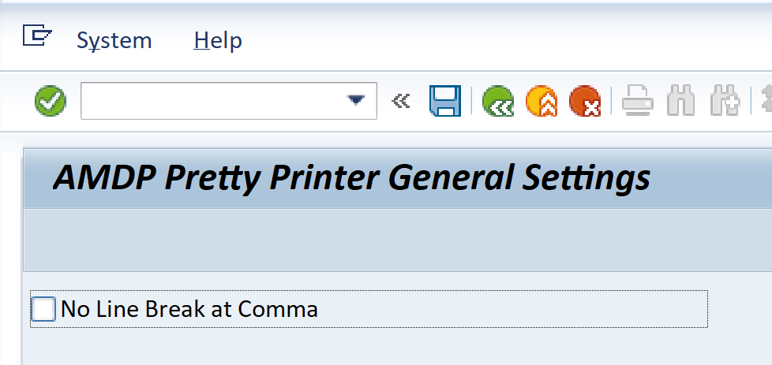
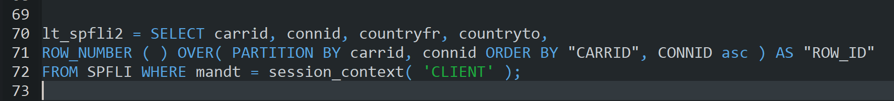
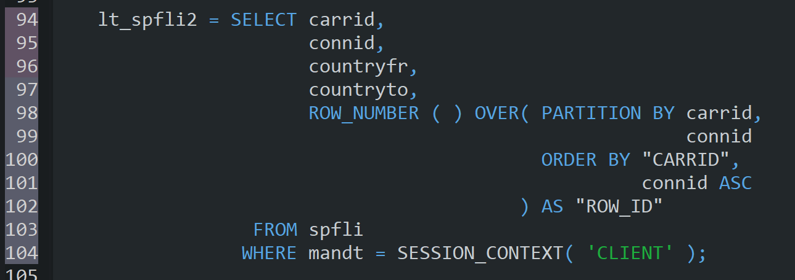
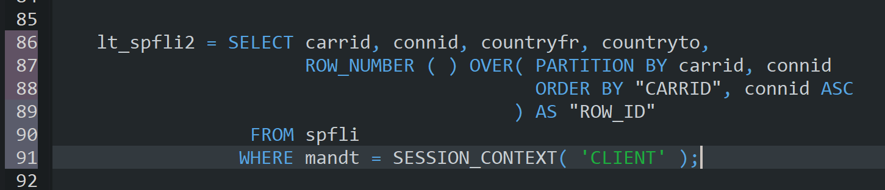
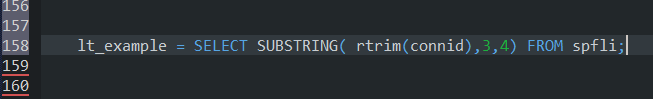
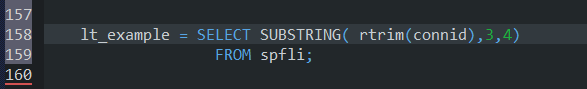
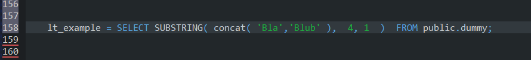
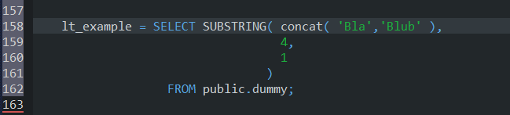

# Configuration

## General

It is possible to configure the AMDP Pretty Printer with the transaction
ZAPP_SETTINGS.

There are two different kinds of settings. General settings and user
specific settings.

The general settings are valid for all users. But if a user defines his
own settings, then only his settings will be used.

Often several users
work on the same coding, so it is recommended to agree on general
settings in the project and not to use user specific settings.

If nothing is configured, then the default will be used (see the
settings for detail).

## Line Break after Comma Rule

There is currently only the setting “Line Break after Comma Rule”.

It controls how the AMDP Pretty Printer handles line breaks after the comma.
The following options are possible:

- 0 => add a line break after a comma
- 1 => add no line break after a comma
- 2 => add no line break after a comma at simple functions, if the following criterions are fulfilled:
  - the closing bracket is originally in the same row as the function name
  - a possible sub function contains no comma and no select statement
  - it is one of the following functions:
    - SUBSTRING
    - SUBSTR_AFTER
    - SUBSTR_BEFORE
    - RPAD
    - LPAD
    - CONCAT
    - NULLIF
    - IFNULL

If nothing is configured, then a line break will be added.

### Example option 0 (with line break) vs option 1 (without line break)

The unformatted AMDP source code:

The formatted AMDP source code will look like this **with** the line break after the comma:

The formatted AMDP source code will look like this **without** the line break after the comma:

### Examples of option 3 (no line break after comma for simple functions)

No line break in the substring function, because the rtrim function conatains no comma:

Line break in the substring function, because the closing bracket is in the new line:

Line break in the substring function, because the sub function concat contains a comma:

