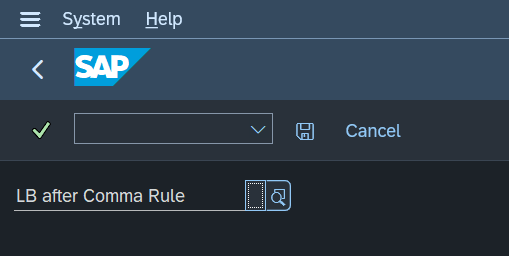

# Configuration

## General

It is possible to configure the AMDP Pretty Printer with the transaction
ZAPP_SETTINGS.

There are two different kinds of settings. General settings and user
specific settings.


The general settings are valid for all users. But if a user defines his
own settings, then only his settings will be used.

Often several users
work on the same coding, so it is recommended to agree on general
settings in the project and not to use user specific settings.

If nothing is configured, then the default will be used (see the
settings for detail).

## Line Break after Comma Rule

There is currently only the setting “Line Break after Comma Rule”.



It controls how the AMDP Pretty Printer handles line breaks after the comma.
The following options are possible:

- 0 => add a line break after a comma
- 1 => add no line break after a comma
- 2 => add no line break after a comma at simple functions, if the following criterions are fulfilled:
  -	the function including sub functions contains no select statement
  - the closing bracket is originally in the same row as the function name
- 3 => add no line break after a comma at simple functions, if the following criterions are fulfilled:
  - the function including sub functions contains no select statement
  - the closing bracket is originally in the same row as the function name
  - a possible sub function contains no comma
- 4 => add no line break after a comma at simple functions, if the following criterions are fulfilled:
  - the function including sub functions contains no select statement
  - the closing bracket is originally in the same row as the function name
  - a possible sub function contains no comma
  - the function contains in total not more than one keyword (in the brackets)
  

If nothing is configured, then a line break will be added (option 0).

### Example option 0 (with line break) vs option 1 (without line break)

The unformatted AMDP source code:

```sql
lt_spfli2 = SELECT carrid, connid, countryfr, countryto,
ROW_NUMBER ( ) OVER( PARTITION BY carrid, connid ORDER BY "CARRID", CONNID asc ) AS "ROW_ID"
FROM SPFLI WHERE mandt = session_context( 'CLIENT' );
```

The formatted AMDP source code will look like this **with** the line break after the comma:

```sql
lt_spfli2 = SELECT carrid, 
                    connid, 
                    countryfr, 
                    countryto,
                    ROW_NUMBER ( ) OVER( PARTITION BY carrid, 
                                                      connid 
                                        ORDER BY "CARRID", 
                                                  connid ASC 
                                      ) AS "ROW_ID"
              FROM spfli 
             WHERE mandt = SESSION_CONTEXT( 'CLIENT' );
```

The formatted AMDP source code will look like this **without** the line break after the comma:

```sql
lt_spfli2 = SELECT carrid, connid, countryfr, countryto,
                    ROW_NUMBER ( ) OVER( PARTITION BY carrid, connid 
                                        ORDER BY "CARRID", connid ASC 
                                      ) AS "ROW_ID"
              FROM spfli 
              WHERE mandt = SESSION_CONTEXT( 'CLIENT' );
```

### Examples of option 2 (no line break after comma for simple functions dep. closing bracket only)
No line break in the concat function, because the closing bracket is on the same line like the function name:

```sql
lt_example = SELECT CONCAT ('C', concat( 'A','B')) FROM public.dummy;
```

```sql
    lt_example = SELECT CONCAT ('C', CONCAT( 'A','B')) 
                   FROM public.dummy;
```

Line break in the first concat function, because the closing bracket is on the next line:

```sql
lt_example = SELECT CONCAT ('C', concat( 'A','B')
) FROM public.dummy;
```

```sql
lt_example = SELECT CONCAT ('C', 
                            CONCAT( 'A','B')
						               ) 
               FROM public.dummy;
```

Line break in both concat functions, because the closing brackets are both on the next line:

```sql
lt_example = SELECT CONCAT ('C', concat( 'A','B'
)) FROM public.dummy;
```

```sql
lt_example = SELECT CONCAT ('C', 
                            CONCAT( 'A',
                                    'B'
                                  )
                            ) 
               FROM public.dummy;
```

### Examples of option 3 (no line break after comma for simple functions dep. closing bracket and sub function)

No line break in the substring function, because the rtrim function conatains no comma:

```sql
lt_example = SELECT SUBSTRING( rtrim(connid),3,4) FROM spfli;
```

```sql
lt_example = SELECT SUBSTRING( RTRIM(connid),3,4) 
               FROM spfli; 
```

Line break in the substring function, because the closing bracket is in the new line:
```sql
lt_example = SELECT SUBSTRING( rtrim(connid),3,4
) FROM spfli;  
```

```sql
lt_example = SELECT SUBSTRING( RTRIM(connid),
                               3,
                               4
                             ) 
               FROM spfli; 
```

Line break in the substring function, because the sub function concat contains a comma:

```sql
lt_example = SELECT SUBSTRING( concat( 'Bla','Blub' ),  4, 1  )  FROM public.dummy;
```

```sql
lt_example = SELECT SUBSTRING( CONCAT( 'Bla','Blub' ), 
                               4, 
                               1 
                             ) 
               FROM public.dummy;
```

No Line break, because the number of keywords is not relevant:

```sql
lt_example = SELECT CONCAT ( rtrim('BLA '), rtrim('BLUB ') )  FROM public.dummy;
```

```sql
lt_example = SELECT CONCAT ( RTRIM('BLA '), RTRIM('BLUB ') ) 
               FROM public.dummy;
```

### Examples of option 4 (no line break after comma for simple functions dep. closing bracket and sub function and keywords)

No line break in the substring function, because the rtrim function conatains no comma:

```sql
lt_example = SELECT SUBSTRING( rtrim(connid),3,4) FROM spfli;
```

```sql
lt_example = SELECT SUBSTRING( RTRIM(connid),3,4) 
               FROM spfli; 
```

Line break in the substring function, because the closing bracket is in the new line:
```sql
lt_example = SELECT SUBSTRING( rtrim(connid),3,4
) FROM spfli;  
```

```sql
lt_example = SELECT SUBSTRING( RTRIM(connid),
                               3,
                               4
                             ) 
               FROM spfli; 
```

Line break in the substring function, because the sub function concat contains a comma:

```sql
lt_example = SELECT SUBSTRING( concat( 'Bla','Blub' ),  4, 1  )  FROM public.dummy;
```

```sql
lt_example = SELECT SUBSTRING( CONCAT( 'Bla','Blub' ), 
                               4, 
                               1 
                             ) 
               FROM public.dummy;
```

Line break, because there is more than one keyword in the function concat (rtrim):

```sql
lt_example = SELECT CONCAT ( rtrim('BLA '), rtrim('BLUB ') )  FROM public.dummy;
```

```sql
lt_example = SELECT CONCAT ( RTRIM('BLA '), 
                             RTRIM('BLUB ') 
                           )
               FROM public.dummy;
```