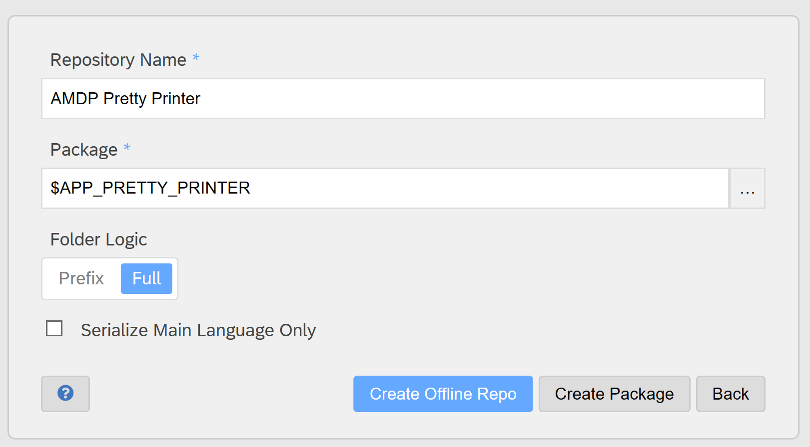

# Installation

The AMDP Pretty Printer consists like the SAP ABAP Development Tools of
a Rest Service in the SAP Development System that contains the Pretty
Printer logic and an Eclipse Plugin that calls the Rest Service and
adjust the coding.

It works with SAP Business Suite on HANA and S/4 HANA (both on premise).
I didn’t check the ABAP Cloud. I assume that it does not work in the
cloud because it uses the command SCAN ABAP SOURCE to get the tokens of
the source code (like the SAP Standard Pretty Printer). This command is
marked in the SAP documenation for internal use.

## Installation of the Eclipse Plugin

The plugin is developed and tested with the Eclipse Version 2021-12.

It requires the following Software:

-   ABAP Development Tools for SAP HANA (Developer Edition) 3.22.1 or
    higher.

-   JRE version 16 or higher (SAP ADT requires only JRE version 11)

See also here

<https://tools.hana.ondemand.com/#abap>

You have to copy the current zapp.pretty.printer\_\*.jar file from the
folder Eclipse Dropin\\plugins to your Eclipse\\dropins folder.

Then you have to restart your Eclipse.

You should see the AMDP Pretty Printer Icon
in your Toolbar in the ABAP
Perspective.

And also, in the Menu when you open an ABAP Class

If you don’t see it, then please check the Error Log after the start of
Eclipse for the errors (Window =\> Show View =\> Error Log).

Some people reported that they see no error in the log, but the plugin
is still not loaded. In this case it helped them to install a fresh
eclipse with the SAP ADT.

## Installation of the AMDP Pretty Printer Logic in the backend

The formatting logic of the AMDP Pretty Printer is written in ABAP. So
it is required to install it in your SAP Development System. It is no
transport and no additional SICF configuration required. It will be
installed to the temporary package $APP_PRETTY_PRINTER with some sub
packages. The Eclipse Plugin uses the existing SAP ADT ICF Service for
the communication with the backend. The Eclipse Plugin sends a post
request to the URL /sap/bc/adt/zapp/zapp_pretty_printer of your SAP
Development System. See also BADI_ADT_REST_RFC_APPLICATION for more
information.

The tool abapGit is required for the installation. You can find it with
a good documentation at <https://abapgit.org/>.

You should install the AMDP Pretty Printer to the package
$APP_PRETTY_PRINTER.

Here is a short manual how to install the Standalone version of abapGit
from scratch and how to upload the AMDP Pretty Printer from an offline
repository (ZIP-File). If you have already experience with abapGit then
the online repository is recommended to easily pull the latest updates.

### Installation of abapGit (Standalone)

Start transaction SE38 in your SAP Development System and create the
program ZABAPGIT_STANDALONE (abapGit Standalone)

Save it as Local Object.

Copy the latest source code from
<https://raw.githubusercontent.com/abapGit/build/main/zabapgit.abap>

and paste it into the program (replace the generated source code). It
takes a while because the program has more than 100.000 lines of code.

Activate the program (CTRL+F3) and start it with F8.

It should look like this:

### Installation of AMDP Pretty Printer with abapGit (offline)

Add first you must download this git repository as ZIP-File from github.

Then start abapGit and click on New Offline.

Enter the following values:

-   Repository Name =\> AMDP Pretty Printer

-   Package =\> $APP_PRETTY_PRINTER

-   Folder Logic =\> Full

Click on Create Offline Repo.

The following screen will appear:

Click on Import zip to upload the ZIP-File.

The following screen will appear when the upload is done:

Click now on Pull zip and the installation will start.

You must activate all shown objects at the end and then the installation
is done.

Hint: The report ZAPP_PRETTY_PRINTER_TEST can be used to test the AMDP
Pretty Printer without the rest service and without the Eclipse Plugin.
Just copy your AMDP Method / Class source code into the first long text
field and press the Pretty Print button.

The right long text field shows the formatted source code. The lower
long text fields can be used to generate Unit Tests. Please be aware
that the long text fields do not show the text in a script where each
character has the same width. So, it could look a little bit ugly, but
it is well formatted. You can copy the result for example to Notepad++
to see the difference.

