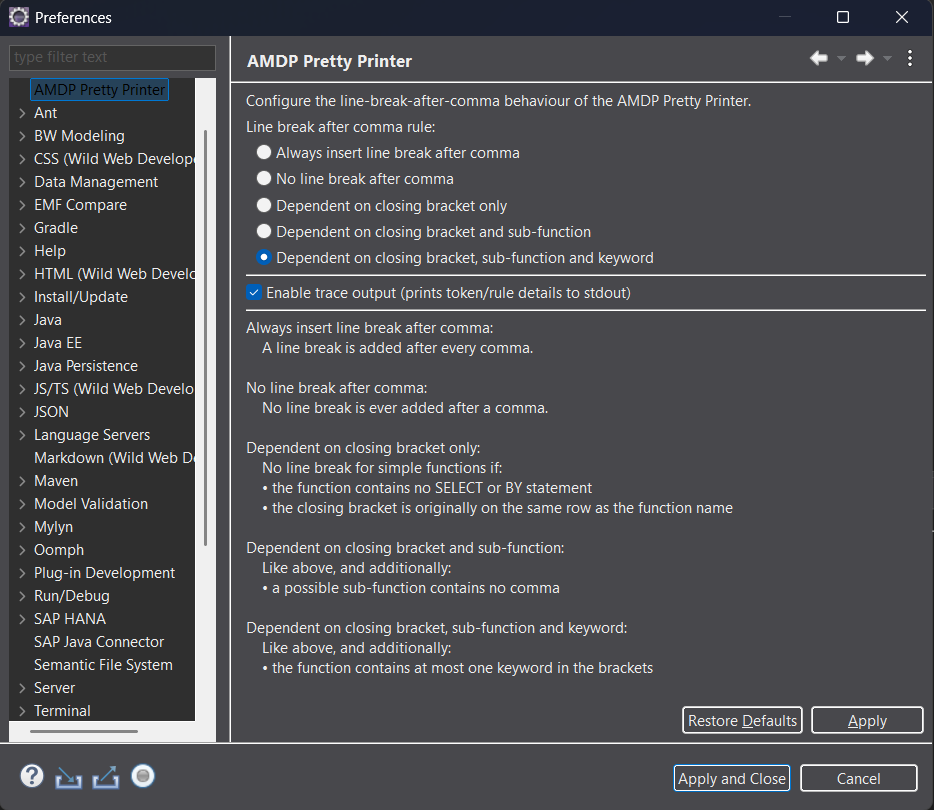
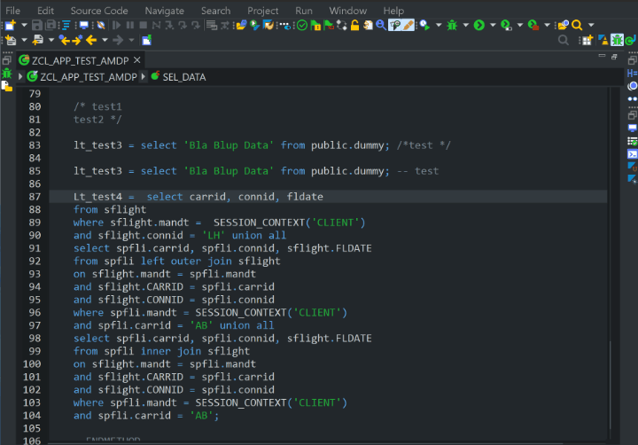

# AMDP Pretty Printer Eclipse Plugin

The AMDP Pretty Printer Eclipse Plugin allows you to format the source code directly with the SAP ABAP Development Tools for Eclipse.

## Installation

Download the file com.github.fmabap.amdpprettyprinter.eclipse*.jar from the [artifacts folder](https://github.com/fmabap/AMDP_Pretty_Printer/tree/main/artifacts).

Move it into your eclipse dropin folder (example ```C:\eclipse\dropins```)

Restart Eclipse.

You should see the icon and the menu entry if you open your SAP System with the ADT Tools.

## Settings

You can configure the Eclipse plugin via the menu entry ```Window → Preferences → AMDP Pretty Printer```



All possible options are described on the screen.

## Usage of the AMDP Pretty Printer

Open your ABAP class that contains the AMDP source code with the SAP ABAP Development Tools.

You have 3 options to run the AMDP Pretty Printer:

- Click on the icon
- Use the menu ```Source Code → AMDP Pretty Printer```
- Press ```CTRL + 0```
  

