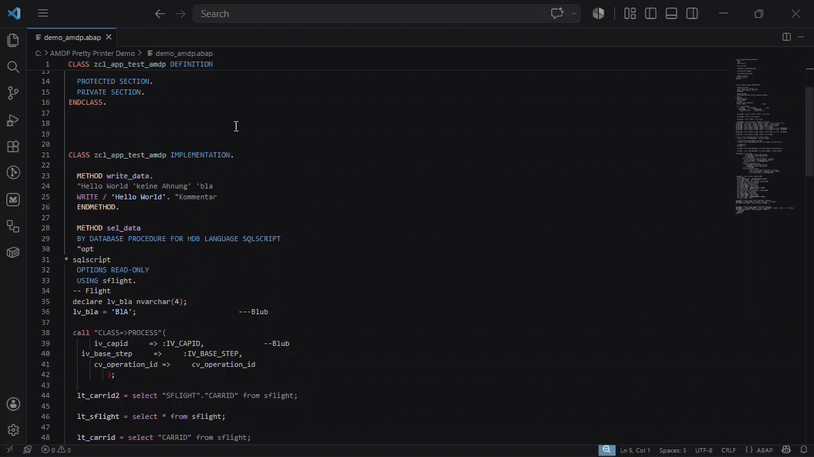

# AMDP Pretty Printer – VS Code Extension

Formats **ABAP Managed Database Procedure (AMDP)** source code directly inside VS Code using the AMDP Pretty Printer core engine (Java).



---

## Installation

## Requirements

| Requirement | Details |
| --- | --- |
| VS Code | 1.85.0 or newer |
| Java | 21 or newer on your `PATH` (or configure the path manually – see [Settings](#settings)) |

---

## Features

- **Document formatter** – registered for all file types; use VS Code's built-in *Format Document* action (`Shift+Alt+F` on Windows/Linux, `⇧⌥F` on macOS).
- **Explicit command** – *Format with the AMDP Pretty Printer* available via the Command Palette (`Ctrl+Shift+P`).
- **Keyboard shortcut** – `Ctrl+Alt+Shift+0` triggers formatting in any focused editor.
- **Configurable line-break rule** – control exactly when line breaks are inserted after commas (see [Settings](#settings)).
- **Bundled JAR** – a ready-to-use fat-JAR is included in the extension; no separate installation step is required.

---

## Usage

1. Open any AMDP / SQLScript file.
2. Format it using one of the following methods:
   - Press `Ctrl+Alt+Shift+0`.
   - Open the Command Palette (`Ctrl+Shift+P`) and run **Format with the AMDP Pretty Printer**.
   - Use VS Code's standard *Format Document* command (`Shift+Alt+F`). If multiple formatters are installed, VS Code will ask you to select one – choose *AMDP Pretty Printer*.

---

## Settings

All settings are under the `amdp-pretty-printer` namespace and can be configured in your `settings.json` or via *File → Preferences → Settings*.

### `amdp-pretty-printer.lbRule`

Controls when a line break is inserted **after a comma**.

| Value | Behaviour |
| --- | --- |
| `0` | Always insert a line break after a comma |
| `1` | Never insert a line break after a comma |
| `2` | Depends on the closing bracket |
| `3` | Depends on the closing bracket and sub-functions |
| `4` *(default)* | Depends on the closing bracket, sub-functions, and keywords |

**Type:** `number` · **Default:** `4`

---

### `amdp-pretty-printer.javaPath`

Path to the Java 21+ executable used to run the formatter JAR.  
Set this if `java` is not on your system `PATH` or if you want to use a specific JRE/JDK installation.

You must escape the '\' with '\\'

**Type:** `string` · **Default:** `"java"`

**Example:**

```json
"amdp-pretty-printer.javaPath": "C:\\Program Files\\Java\\jdk-21\\bin\\java.exe"
```

You can also use the JRE that is shipped with Eclipse. Just search in the Eclipse plugins folder for the java.exe.

The path depends on your Eclipse version.

**Example:**

```json
"amdp-pretty-printer.javaPath": "C:\\eclipse\\plugins\\org.eclipse.justj.openjdk.hotspot.jre.full.win32.x86_64_21.0.10.v20260205-0638\\jre\\bin\\java.exe"
```

---

### `amdp-pretty-printer.trace`

Passes the `--trace` flag to the formatter process, which causes it to write additional diagnostic output to stderr. Useful for debugging unexpected formatting results.

**Type:** `boolean` · **Default:** `false`

---

## How It Works

The extension spawns the AMDP Pretty Printer fat-JAR as a child process and communicates with it via **stdin / stdout**:

1. The full document text is written to the process's stdin.
2. The formatted text is read back from stdout.
3. If the output differs from the input, VS Code's text-editing API replaces the entire document content.

The process is given a **30-second timeout**. If the JAR does not respond within that window the child process is killed and an error message is shown.

---

## Troubleshooting

| Problem | Solution |
| --- | --- |
| *"Failed to start Java process"* / *ENOENT* | Java is not on your `PATH`. Set `amdp-pretty-printer.javaPath` to the full path of your `java` executable. |
| *"Timed out after 30 s"* | The input is unusually large or Java startup is slow. Enable `amdp-pretty-printer.trace` and check the output for hints. |
| Formatter is not triggered by `Shift+Alt+F` | VS Code may be using a different default formatter. Open the Command Palette and run *Format Document With…*, then select *AMDP Pretty Printer*. |

---

## Plugin for Eclipse

The plugin is also available for Eclipse.

See <https://github.com/fmabap/AMDP_Pretty_Printer> for details.

## License

MIT – see [LICENSE](LICENSE).
